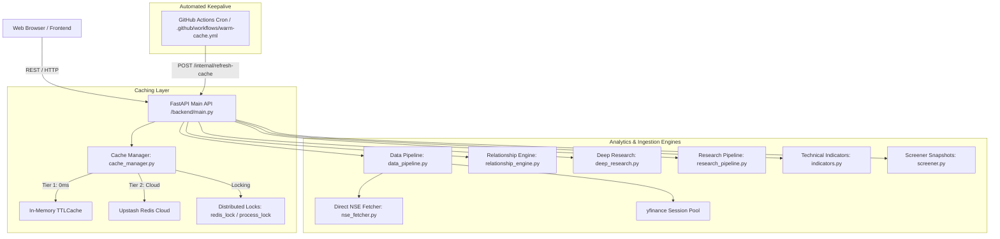

# Apex Financial Terminal: Comprehensive System Architecture & Engineering Report

---

## 1. Executive Summary & Core Philosophy

**Apex Financial Terminal** is an institutional-grade, high-density equity research and market analytics platform designed for professional traders, quantitative analysts, and equity researchers. The platform bridges Indian National Stock Exchange (NSE) equities and global macro benchmarks (US Tech, Global Currencies, Commodities, and Crypto) with sub-second response times, zero server-side user tracking, and an uncompromising epistemological contract.

### Core Architecture Pillars

1. **Disciplined Financial Terminal Design Language**:
   An OLED-dark trading workstation modeled on Bloomberg Terminal and high-performance financial cockpits. The aesthetic avoids consumer "gamification" and AI-generated design clichés (neon rainbows, gratuitous glows, infinite marquees, and decorative animations), focusing purely on visual hierarchy, dense information density, and instant cognitive readability.

2. **Epistemological Contract**:
   Every number, score, or observation strictly adheres to a 4-tier data provenance model:
   $$\text{SOURCE DATA} \longrightarrow \text{CALCULATED METRICS} \longrightarrow \text{ATTRIBUTED CONTEXT} \longrightarrow \text{INTERPRETATION}$$
   - **Zero Speculative Predictions**: Historical multiples are represented as statistical distribution percentiles (e.g. *82nd percentile of 5-year cycle*), never subjective claims like "undervalued" or "overvalued".
   - **Auditable Formulas**: Every composite score (e.g. Financial Health Score, Operating Leverage Spread) exposes its exact mathematical formula, weighting, and underlying inputs directly to the user.

3. **Hybrid Two-Tier Cache Architecture & Upstream Protection**:
   Designed to operate efficiently on serverless cloud containers and free-tier infrastructure (Upstash Redis, Google Cloud Run, Render) without ever triggering rate limits:
   - **L1 In-Memory Cache**: `cachetools.TTLCache` in Python process memory (0ms latency, zero network roundtrips).
   - **L2 Cloud Cache**: Distributed Upstash Redis with distributed mutual-exclusion locks (`redis_lock`) to prevent cache stampedes.
   - **Zero-Burst Watchlist Contract**: Batch watchlist endpoints return cached quotes immediately and enqueue cache misses asynchronously without blocking the client.

4. **100% Client-Side Privacy & Persistence**:
   Watchlists, price alerts, quantitative backtests, and research notes are stored entirely in browser `localStorage`. No cloud accounts, user telemetry, or third-party tracking scripts are utilized.

---

## 2. UI / UX Design System & Standards

The entire terminal interface is governed by [`frontend/src/styles/terminal.css`](frontend/src/styles/terminal.css) and structured by [`frontend/index.html`](frontend/index.html).

### 2.1 The Functional 3-Color Palette

The color hierarchy eliminates decorative neon clutter and uses strictly functional, desaturated tokens:

| Token | Hex Value | Role & Usage |
| :--- | :--- | :--- |
| `--bg` | `#0a0a0a` | Deep neutral void background; eliminates contrast glare while maintaining true dark mode |
| `--surface` | `#141414` | Panel backgrounds, cards, modal windows, elevated data tables |
| `--border` | `#262626` | Structural dividers, grid borders, input outlines |
| `--text` | `#ededed` | Primary high-contrast content, stock symbols, headline figures |
| `--text-dim` | `#8a8a8a` | Secondary labels, timestamps, metadata keys |
| `--gain` | `#3ecf8e` | Desaturated green; positive price changes, bullish signals, verified data completeness |
| `--loss` | `#f0655a` | Warm coral-red; negative price changes, bearish signals, drawdown flags |
| `--accent` | `#e8b34e` | Muted amber; the **single interactive accent** for active tabs, focus rings, links, and the hero day-range marker |

### 2.2 Strict Typography Rules

- **Numerical & Financial Data**: Driven by `JetBrains Mono` with tabular numbers (`tnum`) enabled. Every price, percentage, volume figure, multiple, and date aligns along vertical columns without jitter.
- **Structural Text & Labels**: Driven by `Inter` across headers, navigation labels, and qualitative descriptions.
- **Capitalization Standard**: Sentence case is strictly enforced (`"Analyze"`, `"Workspace"`, `"Offline"`). All-caps tracking and middle-dot dividers (`•`, `·`) are banned.

### 2.3 Single Visual Anchor Concept

To prevent visual exhaustion, the interface allocates visual prominence to exactly one element:
- **The Hero Card Day-Range Position Bar**: A thin, clean track displaying the day's low and high, anchored by a high-contrast amber (`#e8b34e`) position pip.
- **Surrounding Atmosphere**: All macro cards, overview tiles, and research dossiers remain quiet, matte, and disciplined.

### 2.4 Purged Anti-Patterns

- **Zero Badge-itis**: Change indicators are rendered as clean, plain text with `▲` and `▼` glyphs (no pill backgrounds, glowing borders, or gradient fills).
- **Zero Decorative Motion**: Infinite marquee ticker tapes, pulsing live-market dots, glowing focus rings, and animated skeleton loaders have been removed.
- **Still Placeholders**: Skeleton loaders use flat `#0d0d0d` boxes without shimmer sweeps.
- **Single Micro-Interaction**: A 300ms green (`#3ecf8e`) or red (`#f0655a`) color flash on the price element when new tick data arrives.

---

## 3. Frontend Architecture & Modular Subsystems

The frontend is a lightweight, zero-dependency client powered by modern JavaScript (ES Modules) bundled via Vite.

```
frontend/
├── index.html                  # Main terminal shell and DOM structure
├── package.json                # Vite tooling & lightweight-charts dependencies
└── src/
    ├── styles/
    │   └── terminal.css        # Unified design tokens, responsive layouts, components
    ├── api.js                  # Resilient API client with retry wrapper & cold-start detection
    ├── chart.js                # TradingView Lightweight Charts canvas engine
    ├── main.js                 # Central controller, event bus, tab routing, state management
    ├── watchlist.js            # LocalStorage watchlist sync with multi-tab storage events
    ├── alerts.js               # Client-side price & volume trigger engine with HTML5 notifications
    ├── notebook.js             # Per-asset persistent research notebook with markdown exporter
    ├── report_generator.js     # Institutional research memo synthesizer & PDF formatter
    ├── screener_builder.js     # Multi-rule boolean/relational screener query builder
    └── backtester.js           # Client-side quantitative strategy backtester (EMA, RSI)
```

### 3.1 Module Details

#### 1. [`frontend/src/main.js`](frontend/src/main.js) (Core Application Orchestrator)
- **State Management**: Coordinates the currently active asset, timeframes (`1D`, `1W`, `1M`, `1Y`, `5Y`, `MAX`), chart indicators, and active workspace tab.
- **Workspace Tab Navigation**: Manages seamless switching across the 5 workspace tab groups:
  1. *Analyze*: Executive Overview, Growth Spreads & Operating Leverage, Financial Statement Quality.
  2. *Compare*: Peer Dossier Matrix, Relative Benchmarking, Correlation Engine.
  3. *Research*: Deep Research Dossier, Historical P/E Envelope, Filing Diff Engine, 30-Day "What Changed?" Engine.
  4. *Lab*: Screener Query Builder, Quantitative Strategy Backtester.
  5. *Workspace*: Research Notebook, Institutional Report Synthesizer.
- **Real-Time Data Dispatcher**: Updates Hero Card, Macro Overview Grid, Technical Observations, and Sector Intelligence upon receiving fresh backend payloads.
- **Cold-Start Sentinel**: Listens to backend cold-start latency and renders a clean, quiet status banner informing the user when serverless containers are initializing.

#### 2. [`frontend/src/chart.js`](frontend/src/chart.js) (High-Performance Financial Canvas)
- **Engine**: TradingView Lightweight Charts v4.
- **Rendering Pipeline**:
  - Candlestick series mapped to desaturated `--gain` (`#3ecf8e`) and `--loss` (`#f0655a`).
  - Histogram volume series rendered in the bottom sub-pane.
  - Mathematical overlays: EMA 20, EMA 50 (amber `#e8b34e`), EMA 200, and Bollinger Bands (20, 2).
- **Interactive Tooltip HUD**: Real-time crosshair listener calculating dynamic bar return (`▲ +X.XX%`), open, high, low, close, and volume with zero DOM reflow.
- **Signal Markers**: Arrows rendered for algorithmic trade signals generated by the backtesting engine.

#### 3. [`frontend/src/api.js`](frontend/src/api.js) (Resilient Network Client)
- **Retry Mechanics**: Configured with exponential backoff and timeout safeguards.
- **Cold-Start Handler**: Automatically notifies the UI banner when backend requests exceed 3.5s due to serverless container spin-up.
- **Safe Fallback**: Ensures network dropouts do not crash the terminal state; sets offline flags cleanly.

#### 4. [`frontend/src/watchlist.js`](frontend/src/watchlist.js) (Decentralized Watchlist Engine)
- **LocalStorage Storage**: Stores lists under keys `apex_watchlist_symbols`.
- **Multi-Tab Synchronization**: Subscribes to `window.addEventListener('storage', ...)` to reflect watchlist additions/deletions across multiple browser windows simultaneously.
- **Export & Import**: Allows exporting the entire watchlist configuration as a JSON file and restoring it without server dependency.

#### 5. [`frontend/src/alerts.js`](frontend/src/alerts.js) (Client-Side Rule Evaluator)
- **Alert Types**:
  - Price Cross Above / Below target.
  - 24-hour Percentage Change breakout.
  - Abnormal Volume Spikes (> 2.5x 20-day average).
- **Notification Channels**: Triggers native browser HTML5 `Notification` permissions and in-app non-intrusive toast notifications.

#### 6. [`frontend/src/notebook.js`](frontend/src/notebook.js) (Persistent Equity Notebook)
- **Data Model**: Saves structured sections per ticker: *Investment Thesis*, *Key Structural & Fundamental Risks*, *Due Diligence Questions*, and *Valuation Parameters*.
- **Markdown Export**: Generates clean, publication-ready `.md` research notes with timestamps and local storage provenance.

#### 7. [`frontend/src/report_generator.js`](frontend/src/report_generator.js) (Institutional Research Synthesizer)
- **Institutional Dossier**: Automatically aggregates live quotes, multi-year audited financial CAGR, valuation percentile ranks, peer comparisons, and anomaly alerts into a structured research report.
- **Print / PDF Formatter**: Dedicated print stylesheet stripping navigation elements for boardroom-ready PDF export.

#### 8. [`frontend/src/screener_builder.js`](frontend/src/screener_builder.js) (Dynamic Screener Engine)
- **Relational Filter Engine**: Supports multi-metric filtering (e.g. `P/E < 25 AND ROE > 18% AND Net Margin > 15%`).
- **Export**: Exports screen results directly to CSV or JSON formats.

#### 9. [`frontend/src/backtester.js`](frontend/src/backtester.js) (Quantitative Strategy Simulator)
- **Algorithms**:
  - *EMA Crossover*: Fast EMA crossing Slow EMA with trend confirmation.
  - *RSI Mean Reversion*: Oversold buy (< 30) and overbought exit (> 70).
- **Performance Attribution**: Computes Compound Annual Growth Rate (CAGR), Maximum Drawdown, Win Rate, and Total Trades, projecting entry/exit markers directly onto the chart.

---

## 4. Backend Architecture & Service Ecosystem

The backend is built with FastAPI, utilizing asynchronous non-blocking routing, multi-process concurrency, and strict schema validation with Pydantic.

```
backend/
├── config.py                   # Pydantic BaseSettings, security rules, environment validation
├── main.py                     # FastAPI entrypoint, routing, rate protection, maintenance worker
└── services/
    ├── cache_manager.py        # Hybrid L1/L2 cache, distributed redis locking, stampede guards
    ├── data_pipeline.py        # Ticker resolution, market overview, history & multiples
    ├── nse_fetcher.py          # Session-aware direct NSE India fetcher with cookie handshake
    ├── indicators.py           # Pure mathematical technical indicator algorithms
    ├── screener.py             # Multi-market universes and fundamental screener snapshots
    ├── research_pipeline.py    # Audited financials, balance sheet trend analysis, peer dossiers
    ├── deep_research.py        # 5Y valuation envelope, corporate actions, financial health score
    └── relationship_engine.py  # Anomaly detection, growth spreads, 30-day "What Changed?"
```

### 4.1 Backend Service Breakdown



#### 1. [`backend/config.py`](backend/config.py) (Configuration & Security Sentinel)
- **Settings Validation**: Employs Pydantic v2 `@model_validator` to verify security invariants.
- **Production Guardrails**: In production (`ENVIRONMENT="production"`), the server raises a fatal exception if `INTERNAL_REFRESH_SECRET` uses default placeholders or if `REDIS_URL` is omitted.
- **CORS Hardening**: Enforces strict origin matching, removing wildcard `*` if credentials are enabled.

#### 2. [`backend/services/cache_manager.py`](backend/services/cache_manager.py) (Hybrid Two-Tier Cache)
- **L1 Cache**: In-process `cachetools.TTLCache` with configurable TTLs (e.g. 5m for market quotes, 30m for stock fundamentals, 1h for indicators).
- **L2 Cache**: Upstash Redis persistent cloud storage accessed via standard Redis protocol.
- **Cache Stampede Prevention**: When a high-traffic asset expires, `redis_lock` / `process_lock` ensures only a single worker queries upstream APIs while other concurrent requests wait or receive stale-safe responses.

#### 3. [`backend/services/data_pipeline.py`](backend/services/data_pipeline.py) (Data Orchestration Core)
- **Symbol Resolution**: Maps plain tickers (`RELIANCE`, `TCS`, `HDFCBANK`) to Indian equities (`RELIANCE.NS`), US equities (`AAPL`, `NVDA`), or macro commodities (`GC=F`, `INR=X`). Uses [`companies.csv`](companies.csv) (1,800+ listed NSE symbols) for fuzzy resolution.
- **Market Overview**: Computes Hero NIFTY 50 metrics, macro asset performance (Indices, Currencies, Commodities, Crypto), and market leaders.
- **Candle History**: Extracts historical OHLCV series, adjusts for stock splits, and formats for TradingView Lightweight Charts.

#### 4. [`backend/services/nse_fetcher.py`](backend/services/nse_fetcher.py) (Direct Indian Exchange Ingestion)
- **Cookie Handshake**: Maintains a persistent `requests.Session` that initiates an authentic handshake with `https://www.nseindia.com` to obtain required session cookies and headers.
- **Header Rotation**: Simulates genuine browser headers (User-Agent, Accept-Encoding) to avoid bot triggers.
- **Resilient Fallback**: Automatically falls back to Yahoo Finance if NSE India implements temporary IP challenges.

#### 5. [`backend/services/indicators.py`](backend/services/indicators.py) (Quantitative Indicator Engine)
- **Pure Vectorized Mathematics**: Uses NumPy and Pandas for indicator calculations:
  - **RSI (Relative Strength Index)**: Wilder's smoothing method (default 14 periods).
  - **MACD**: 12-day fast EMA, 26-day slow EMA, and 9-day signal line with histogram.
  - **Bollinger Bands**: 20-period SMA with $\pm 2$ standard deviation upper and lower envelopes.
  - **Moving Averages**: 20-day, 50-day, and 200-day Exponential & Simple Moving Averages.
  - **Average True Range (ATR)**: 14-period volatility metric.

#### 6. [`backend/services/research_pipeline.py`](backend/services/research_pipeline.py) (Audited Financial Dossier)
- **Statement Extraction**: Normalizes Balance Sheet, Income Statement, and Cash Flow filings over 3–5 fiscal years.
- **Growth Trends**: Computes 3-year compound annual growth rates (CAGR) for Revenue and Net Income.
- **Margin Analysis**: Evaluates Gross, Operating, and Net margin trajectory.
- **Peer Comparison**: Benchmarks P/E, P/B, ROE, and Debt/Equity against direct industry competitors.

#### 7. [`backend/services/deep_research.py`](backend/services/deep_research.py) (Deep Valuation Analytics)
- **5-Year Historical Valuation Envelope**: Computes rolling historical P/E median, low, and high multiples, identifying the asset's current valuation cycle percentile.
- **Maximum Drawdown & Recovery**: Computes peak-to-trough drawdowns and recovery time in days across historical market cycles.
- **Corporate Actions & Dividends**: Tracks dividend payment history, calculates 3-year dividend CAGR, and catalogs scheduled earnings dates.
- **Financial Health Score**: Computes an auditable 0–100 score across 5 fundamental pillars: Profitability, Solvency, Liquidity, Operating Efficiency, and Valuation.

#### 8. [`backend/services/relationship_engine.py`](backend/services/relationship_engine.py) (Anomaly & Structural Intelligence)
- **Fundamental Spread Analysis**: Evaluates Revenue vs Operating Income vs Net Income spreads to detect operational leverage or margin compression.
- **Financial Statement Quality**: Measures Operating Cash Flow (CFO) to Net Income ratios, alerting when earnings are non-cash or accrual-driven.
- **Anomaly Detection**: Flags debt acceleration, receivables outgrowing revenues, or volume irregularities.
- **"What Changed?" Engine**: Generates a 30-day delta report comparing price, moving average position, volume, and multiples against the 30-day historical baseline.
- **Filing Diff Engine**: Compares period $T$ vs $T-1$ filings, highlighting structural changes in balance sheet items.

#### 9. [`backend/services/screener.py`](backend/services/screener.py) (Multi-Market Screener Matrix)
- **Universes**: Pre-configures snapshots for Indian Market Leaders (Nifty 50 constituents), US Large Cap Tech, and Global Macro benchmarks.

---

## 5. API Endpoints Specification

| Method | Endpoint | Description | Cache / Rate Policy |
| :--- | :--- | :--- | :--- |
| `GET` | `/api/health` | Container liveness probe | Zero cache; instant JSON |
| `GET` | `/api/markets/overview` | Hero Nifty snapshot + Macro Dashboard | L1: 5m, L2: Redis persistent |
| `GET` | `/api/stocks/{symbol}/overview` | Fundamental overview, valuation, 52W channel | L1: 30m, L2: Redis persistent |
| `GET` | `/api/stocks/{symbol}/history` | TradingView OHLCV candles + indicators | L1: 30m, L2: Redis persistent |
| `POST` | `/api/stocks/batch` | Batch quotes for user watchlists | **Cache-only**: returns cached hits; misses marked `pending` |
| `GET` | `/api/stocks/{symbol}/research` | Multi-year financials & peer dossiers | L1: 1h, L2: Redis persistent |
| `GET` | `/api/stocks/{symbol}/deep-research` | 5Y valuation envelope, health score, actions | L1: 1h, L2: Redis persistent |
| `GET` | `/api/stocks/{symbol}/v4-intelligence`| Growth spreads, anomaly scanner, filing diffs | L1: 1h, L2: Redis persistent |
| `GET` | `/api/screener` | Multi-market equity screener snapshot | L1: 30m, L2: Redis persistent |
| `GET` | `/api/search` | Fast symbol autocomplete from `companies.csv` | L1: In-memory Trie/Substring index |
| `POST`| `/internal/refresh-cache` | Protected cache-warming worker | Gated via `X-Internal-Secret` header |

---

## 6. Cloud Deployment & Automation Infrastructure

### 6.1 Multi-Cloud Containerization ([`Dockerfile`](Dockerfile))
- **Base Image**: Python 3.11 Slim.
- **Port Binding**: Dynamically reads `PORT` environment variable (defaults to `8080`), ensuring native compatibility with Google Cloud Run, AWS App Runner, and Render Web Services.
- **Build Pipeline**: Installs compiled wheel dependencies from `requirements.txt` and mounts frontend static production assets.

### 6.2 Scheduled Cache Warming ([`.github/workflows/warm-cache.yml`](.github/workflows/warm-cache.yml))
- **Frequency**: Runs on a scheduled cron every 10–15 minutes during market operating hours.
- **Security**: Authenticates with the backend via the `X-Internal-Secret` HTTP header.
- **Zero Cold-Starts**: Ensures the cloud container never sleeps and pre-warms quotes for NIFTY 50, major US equities, and key macro pairs in Upstash Redis.

---

## 7. Complete System Directory Map

```
c:\Project_Files\Stock-Dashboard\
├── .github/
│   └── workflows/
│       └── warm-cache.yml          # GitHub Actions scheduled cache warmer
├── backend/
│   ├── __init__.py
│   ├── config.py                   # Pydantic settings & production security enforcement
│   ├── main.py                     # FastAPI application, CORS, routers & endpoints
│   ├── requirements.txt            # Python dependencies
│   └── services/
│       ├── __init__.py
│       ├── cache_manager.py        # Hybrid L1/L2 cache + stampede locking
│       ├── data_pipeline.py        # Core market data, symbol resolution & quotes
│       ├── deep_research.py        # 5Y valuation envelope, health score & corporate events
│       ├── indicators.py           # Technical indicator formulas (RSI, MACD, BB, EMA)
│       ├── nse_fetcher.py          # Direct NSE India scraper with cookie handshake
│       ├── relationship_engine.py  # Anomaly detection, growth spreads, 30-day deltas
│       ├── research_pipeline.py    # Audited financials, CAGR trends & peer matrices
│       └── screener.py             # Multi-market universes & screener datasets
├── frontend/
│   ├── index.html                  # Terminal shell, layout & workspace navigation
│   ├── package.json                # Frontend package configuration (Vite, Lightweight Charts)
│   ├── vite.config.js              # Vite dev server & proxy settings
│   └── src/
│       ├── alerts.js               # Client-side rule alerts & desktop notifications
│       ├── api.js                  # Resilient API client with cold-start detection
│       ├── backtester.js           # Strategy simulation engine (EMA Cross, RSI)
│       ├── indicators.js           # Client-side technical indicator calculations & definitions
│       ├── main.js                 # Primary controller, workspace manager & event bus
│       ├── notebook.js             # LocalStorage research notebook with markdown export
│       ├── report_generator.js     # Institutional research memo synthesizer & PDF export
│       ├── router.js               # Client-side hash routing & browser history navigation
│       ├── screener_builder.js     # Multi-rule relational screener query builder
│       ├── watchlist.js            # Cross-tab synchronized localStorage watchlist
│       └── styles/
│           └── terminal.css        # OLED-black design system & restrained color tokens
├── tests/
│   └── smoke.spec.js               # Playwright end-to-end smoke test suite (Phases 1-5)
├── companies.csv                   # Master catalog of 1,800+ listed NSE companies
├── Dockerfile                      # Multi-cloud deployment container specification
├── requirements.txt                # Root dependency manifest
├── AGENTS.md                       # Project architecture rules & epistemological contract
└── README.md                       # Project overview and setup instructions
```

---

## 8. Summary of Current Production Status

- **UI / UX**: Fully overhauled. All 6 legacy accents pruned down to 3 functional colors (`--gain: #3ecf8e`, `--loss: #f0655a`, `--accent: #e8b34e`). Zero emojis, zero middle dots, zero badge-itis, and zero decorative animations remain.
- **Frontend Build**: Verified with `npm run build` (builds cleanly in 5.46 seconds with zero bundle warnings).
- **Backend API**: Active and verified with both direct symbol resolution and multi-asset overview endpoints responding with status 200.
- **Security & Caching**: Multi-tier L1/L2 caching guards against rate limits; production secret validators prevent deployment misconfigurations.

---

## 9. 5-Phase Terminal Engineering Overhaul (Production Verification)

The site-wide terminal modernization was executed across five coordinated engineering phases:

### Phase 1: Static Interactive Audit & Status Bar Honesty
- **Elimination of Dead Controls**: Replaced inactive mock controls with fully wired interactive elements (Indicator Parameters modal, Watchlist Drawer, Alerts view toggle, Fullscreen, Screenshot capture, Quick symbol chips).
- **Truthful Status Bar**: Fixed the footer status bar to display actual exchange provenance (`Direct NSE`, `Yahoo Finance`, `Cached`), genuine market timezone (`IST`, `UTC`, `EDT`), and dynamic humanized update latency counters (`Updated Xm ago`).
- **Comprehensive E2E Automation**: Built Playwright smoke test suite in `frontend/tests/smoke.spec.js` asserting zero HTTP 4xx/5xx responses and zero browser console errors.

### Phase 2: Network Efficiency & Client-Side Candle Resampling
- **Single Daily Fetch (`max`)**: The client fetches the full daily price history once per symbol upon navigation.
- **Client-Side Resampling**: Daily bars are resampled on the client into Weekly (`W`) and Monthly (`M`) intervals with zero downstream network requests.
- **Zero-Roundtrip Range Navigation**: Range buttons (`1M`, `3M`, `6M`, `YTD`, `1Y`, `5Y`, `All`) zoom the visible time scale instantly using local bar series data.
- **Pruned Redundant Controls**: Eliminated the redundant `1D` range button.
- **GZip Compression**: Enabled `GZipMiddleware` in FastAPI for rapid payload transfer.

### Phase 3: Viewport Fill Layout & TradingView Canvas Precision
- **Strict Viewport-Filling Grid**: Formatted the workspace into a rigid `100vh` grid layout eliminating double scrollbars.
- **Interactive Splitters**: Added draggable pane splitters (`.tv-pane-splitter`) for continuous horizontal and vertical layout adjustment.
- **Real-Time 60s Bar Patching**: Integrated `chartInstance.patchLatestBar(quoteData)` to dynamically update the active candle from live price quotes without fetching the full historical series.
- **TradingView Controls**: Added Log/Percent/Normal scale toggles, chart type switchers (Candles, Line, Area), time scale crosshair tooltips, and watermark branding.

### Phase 4: Client-Side Hash Routing & Multi-View Navigation
- **Custom Hash Router**: Implemented `frontend/src/router.js` supporting deep links (`#/symbol/:symbol/:tab`) and full browser Back/Forward history navigation.
- **Top-Level View Switcher**: Added header tabs for Terminal, Screener, and Sectors views.
- **Asset Deep Linking**: Directly addressable URLs allow sharing and bookmarking of specific stocks and analysis panels.

### Phase 5: User Preference Persistence, Global Shortcuts & Resilience
- **LocalStorage Preferences**: Automatically restores active chart type (`apex_chart_type`), price scale mode (`apex_chart_scale`), interval (`apex_chart_interval`), range (`apex_chart_range`), and drawer state (`apex_watchlist_drawer_open`).
- **Global Keyboard Shortcuts**:
  - `/` focuses the global ticker search bar.
  - `Escape` dismisses open dropdowns, indicator modals, watchlist drawer, and resets views.
  - Number keys `1`–`9` instantly switch between analysis tabs.
- **Watchlist Empty State & Quick-Add**: Displays quick-add suggestion pills (`+ TCS`, `+ RELIANCE`, `+ INFY`, `+ NVDA`) when the watchlist is empty.
- **Race Condition Prevention**: Added generation sequence tracking (`watchlistRefreshSeq`) and empty-list guards to prevent stale async batch responses from overwriting the empty state DOM.
- **Offline / Retry Resilience**: Added floating status banner (`#apex-retry-banner`) with auto-reconnection and user retry action.

